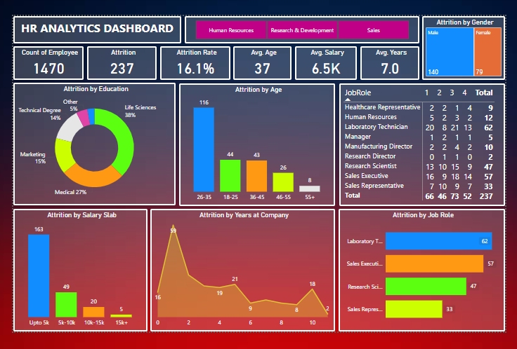

# HR-Analytics-Dashboard-Using-Power-BI

<h2>Overview</h2>

    This project presents an interactive <strong>HR Analytics Dashboard</strong> created in <strong>Power BI</strong>.
    The dashboard provides insights into key HR metrics, enabling business leaders and HR teams to make data-driven 
    decisions based on real-time data. This tool is designed to track and analyze critical HR trends such as employee 
    retention, performance, diversity, and attrition.

<h2>Key Features</h2>
<ul>
    <li><strong>Employee Retention & Attrition Analysis</strong>: Monitor employee turnover, retention rates, and identify patterns across departments and time.</li>
    <li><strong>Performance Tracking</strong>: Visualize employee performance metrics across different categories.</li>
    <li><strong>Diversity & Inclusion Metrics</strong>: Analyze workforce demographics to evaluate diversity within the company.</li>
    <li><strong>Hiring Trends</strong>: Track hiring patterns over time, visualizing growth and departmental changes.</li>
    <li><strong>Departmental Insights</strong>: Detailed views into each department’s performance, attrition, and composition.</li>
</ul>

<h2>Technologies Used</h2>
<ul>
    <li><strong>Power BI</strong>: Data visualization and dashboard creation.</li>
    <li><strong>DAX (Data Analysis Expressions)</strong>: For advanced data calculations and analysis.</li>
    <li><strong>Microsoft Excel/CSV</strong>: For initial data collection and manipulation.</li>
    <li><strong>Data Modeling</strong>: To ensure data integrity and efficiency for the dashboard.</li>
</ul>

<h2>Dashboard Preview</h2>

    <!-- Add your screenshot links here -->
    

<h2>How to Use</h2>
<ol>
    <li>Download the <code>.pbix</code> file from the repository.</li>
    <li>Open the file in Power BI Desktop.</li>
    <li>Connect your HR data source to visualize your own metrics or use the sample data provided.</li>
    <li>Explore the various report pages and interact with filters for customized insights.</li>
</ol>

<h2>Setup and Installation</h2>
<ol>
    <li>Ensure you have <strong>Power BI Desktop</strong> installed. You can download it from <a href="https://powerbi.microsoft.com/desktop/" target="_blank">here</a>.</li>
    <li>Clone or download this repository:</li>
    <pre>
        <code>https://github.com/akashghagare29/HR-Analytics-Dashboard-Using-Power-BI.git</code>
    </pre>
    <li>Open the <code>HR_Analytics_Dashboard.pbix</code> file in Power BI Desktop.</li>
</ol>

<h2>Sample Data</h2>

    The dataset contains the following key fields:

<ul>
    <li>EmpID: Unique identifier for each employee.</li>
    <li>Age, AgeGroup, Gender: Employee demographic information.</li>
    <li>Attrition: Indicates if the employee has left the company.</li>
    <li>Department, JobRole, EducationField: Job-related details.</li>
    <li>JobSatisfaction, WorkLifeBalance: Metrics indicating employee satisfaction levels.</li>
    <li>YearsAtCompany, YearsInCurrentRole: Tenure-related metrics.</li>
    <li>MonthlyIncome, DailyRate: Salary and performance compensation data.</li>
</ul>

<h2>Future Enhancements</h2>
<ul>
    <li>Integration with live HR systems (like SAP or Workday) for real-time data updates.</li>
    <li>Additional visualizations for recruitment pipelines and employee engagement scores.</li>
    <li>AI-driven predictive analysis to forecast attrition rates.</li>
</ul>
